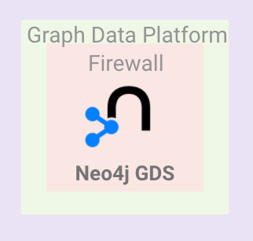
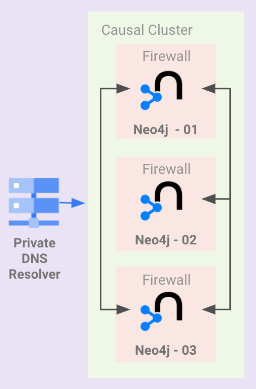
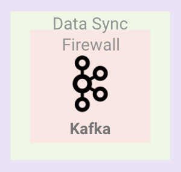

# Neo4j Deployment using Terraform (GCP)

This repo provides [Terraform](https://www.terraform.io/) templates to support deployment of Neo4j Graph Data Platform in some of the major Cloud Service Providers.

## **Folder structure**

All the templates in this repo follow a similar folder structure.

```
./
./main.tf           <-- Terraform file that contains the infrastruture deployment instructions (Infrastruture and Neo4j configs are parameterised and will be passed through the `variable.tf` file)
./provider.tf       <-- Terraform file that contains cloud provider and project information
./variables.tf      <-- Terraform file that contains all the input variables that is required by the `main.tf` file to deploy the infrastruture and Neo4j
./terraform.tfvars  <-- Terraform variables files that contains values to pass to the script. Overrode default values defined in variables.tf. See terraform.tfvars_sample
./assets            <-- All packages used in the deployment will be stored in this folder to reduce external dependencies
./assets/database   <-- Folder contains Neo4j DB tar file (will exist depending on the deployment template)
./assets/licenses   <-- Folder contains License files (will exist depending on the deployment template)
./assets/plugins    <-- Folder contains Plugin files Ex. APOC, GDS, Etc...(will exist depending on the deployment template)
./keys              <-- Folder contains Cloud Service Provider Service Account Keys (This is going to vary from vendor to vendor)
./scripts           <-- Folder contains platform/services setup script template that will be executed after the infrastructure is provisioned
./out               <-- Folder contains rendered setup script that is executed at startup inside the provsioned VM, I use this for validation and tweaking setup post deployment
```

<br>

## **Prerequisites**

### Terraform

A working Terraform setup in your local machine or host which is going to be used to perform the Cloud deployments. You can get the latest version of Terraform [**here**](https://www.terraform.io/downloads.html). I highly go through introduction tutorials [**here**](https://learn.hashicorp.com/tutorials/terraform/infrastructure-as-code?in=terraform/gcp-get-started) for GCP.

<br>

### Google Cloud Platform (GCP)

You will need access to a GCP user account with privileges to create Service Account and assign Roles to support deployment using Terraform.

<br>

## **Setup**

1. Setup Terraform
2. Clone this repo
3. Create a Service Account and assign the following roles:
   1. Compute Admin
   2. Compute Image User
   3. Compute Network Admin
   4. Compute Security Admin
   5. Dataproc Administrator (Optional - If you're going to use DataProc)
   6. Dataproc Worker (Optional - If you're going to use DataProc)
   7. DNS Administrator (Optional - If you're using the Causal Cluster deployment template)
   8. Service Account User
   9. Storage Admin
4. Download the `keys.json` file and place it inside the `./keys/` folder
5. Create `terraform.tfvars` and fill your project details. See `terraform.tfvars_sample` for example. Check the documentation for required variables. Some of them are having default values. 

   Example:

   ```
   project = <Project Name>
   region = <Project Region>
   zone = <Project Zone>
   ```

6. Depending on the deployment you're doing, place the required license keys inside the `./assets/licenses/` folder
   1. **Neo4j-GDS-with-Bloom** template - GDS and Bloom license keys _(Required)_
   2. **Neo4j-Causal-Cluster-with-Bloom** template - Bloom license keys _(Required)_
7. The templates by default are configured with the following verions of the different components, download these version of the components and place it inside the appropriate `./assets/*` folders. If you need a different version of any of the following components, get the required component and place it inside the appropriate `./assets/*` folder and make the corresponding update in the `terraform.tfvars` file to reflect the changes

   Default component versions:

   ```
   # Neo4j
   ./assets/database/neo4j-enterprise-4.3.9-unix.tar.gz (4.3.9) [ Neo4j-Causal-Cluster-with-Bloom | Neo4j-GDS-with-Bloom ]
   ./assets/plugins/apoc-4.3.0.4-all.jar (4.3.0.4) [ Neo4j-Causal-Cluster-with-Bloom | Neo4j-GDS-with-Bloom ]
   ./assets/plugins/google-cloud-storage-dependencies-3.5-apoc.jar (3.5) [ Neo4j-Causal-Cluster-with-Bloom | Neo4j-GDS-with-Bloom ]
   ./assets/plugins/neo4j-bloom-1.9.1.zip (1.9.1) [ Neo4j-Causal-Cluster-with-Bloom | Neo4j-GDS-with-Bloom ]
   ./assets/plugins/neo4j-graph-data-science-1.7.3-standalone.zip (1.7.3) [ Neo4j-GDS-with-Bloom ]
   # Kafka
   ./assets/confluent-community-7.0.0.tar (7.0.0) [ Neo4j-Kafka-Streams ]
   ./assets/neo4j-kafka-connect-neo4j-2.0.0.zip (2.0.0) [ Neo4j-Kafka-Streams ]
   ```

<br>

## **Usage**

### Choose deployment

1. (Optional) - If you want to deploy your instance in a new VPC and a new Subnet, run the [deployment steps](#deployment-steps) for this template `./Neo4j-Networking`
2. Deploying a Neo4j GDS Standalone instance with Bloom, run the [deployment steps](#deployment-steps) for this template `./Neo4j-GDS-with-Bloom`
   <br>
   

3. Deploying a Neo4j Causal Cluster with Bloom with a Private IP DNS resolver, run the [deployment steps](#deployment-steps) for this template `./Neo4j-Causal-Cluster-with-Bloom`
   <br>
   

4. Deploying a Kafka Message Queue with Neo4j Stream with Bloom , run the [deployment steps](#deployment-steps) for this template `./Neo4j-Kafka-Streams`
   <br>
   

5. Deploying a Neo4j GDS standalone instance, Neo4j Causal Cluster and setting up **Data Sync** between them, run the [deployment steps](#deployment-steps) for the following templates:
   1. `./Neo4j-GDS-with-Bloom`
   2. `./Neo4j-Causal-Cluster-with-Bloom`
   3. `./Neo4j-Kafka-Streams`
      <br>
      

### Deployment steps

1. Initialise the Terraform template

```
terraform init
```

2. Plan the deployment, this prints out the infrastructure to be deployed based on the template you have chosen

```
terraform plan
```

3. Deploy!! (By default this is an interactive step, when the time is right be ready to say **`'yes'`**)

```
terraform apply
```

4. When it's time to decommission (destroy) the deployment. (By default this is also an interactive step, when the time is right be ready to say **`'yes'`**)

```
terraform destroy
```

<br>

### Notes
- Add Terraform to your $PATH to make it easier for you to call upon its powers
- If you're using Windows, ensure all scripts (.sh) created (or checked-out from Github) are in Unix format, otherwise it might not executed correctly on created VM.
- On downloading assets, if the version you need is not listed in neo4j.com/download-center. Try to copy the download link to the on the officially listed version, and replace the version to the one you target

<br>

---

`P.S.: Current templates are targeted towards deployments in Google Cloud Platform, if you're interested to develop templates for AWS and Azure drop me a message on Slack (Neo4j Team) or Email me @ maruthiprithivi@gmail.com 🖖🏾🙂`
